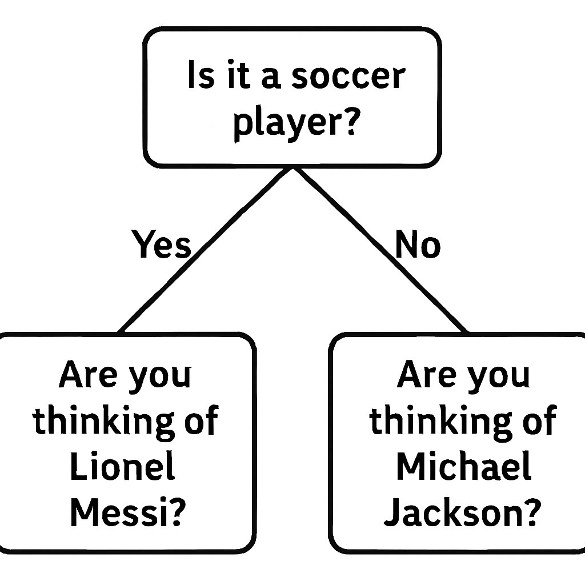
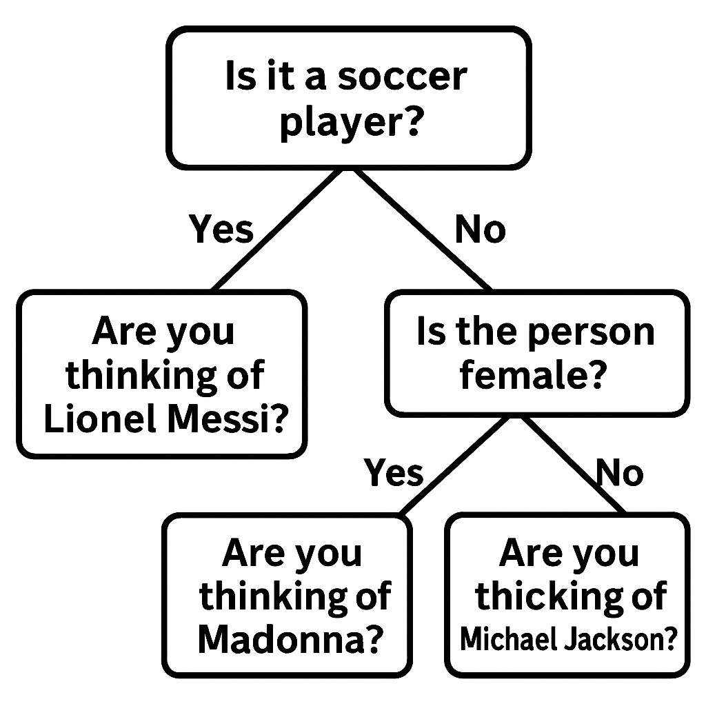

# 🤔 ¿Cómo funciona akinator?

Akinator es un juego de adivinanza en el que el sistema intenta descubrir en qué personaje está pensando el usuario, formulando una serie de preguntas. El funcionamiento se basa en un 🌳 árbol binario que guarda las preguntas siguiendo la idea de un árbol de decisiones.

## ⚙️ Funcionamiento General

1. 🧠 **Idea del Juego**: El usuario piensa en un personaje y el sistema comienza a hacer preguntas de sí/no para acotar las posibilidades. Cada pregunta es un nodo y Akinator se va desplazando en ese árbol según las decisiones del usuario. Esto acota las posibilidades cuando se tiene muchisima información. Por ejemplo si pregunta si tu personaje es cantante y respondes que si pues Akinator descarta todos los personajes que no sean cantantes.

2. 🌳 **Árbol de Preguntas**: El núcleo del juego es un árbol binario donde cada nodo representa una pregunta y cada hoja representa un personaje. Según las respuestas del usuario, el sistema recorre el árbol hasta llegar a una hoja (personaje). 


3. 🎯 📚 **Adivinanza y Aprendizaje**: Cuando el sistema llega a una hoja, intenta adivinar el personaje. Si acierta, el juego termina. Si falla, el sistema solicita al usuario información para aprender. Al equivocarse se crea un nodo nuevo con los datos que solicita el sistema, teniendo como hijo de la ramaa si al personaje que realmente estabas pensando y como hijo de la rama no al personaje con el que había fallado.



## 🛠️ Implementación en este Proyecto
Este es el modelo con el que se trabajan los nodos. Es un modelo recursivo ya que los nodos son preguntas.
```python
class Question(models.Model):
    sentence = models.CharField(max_length=2000)
    parent = models.ForeignKey('self',blank=True,on_delete=models.SET_NULL,null=True,related_name='parentNode')
    yes_answer = models.ForeignKey('self',blank=True,on_delete=models.SET_NULL,null=True,related_name='yesChild')
    no_answer = models.ForeignKey('self',blank=True,on_delete=models.SET_NULL,null=True,related_name='noChild')
    
    
    def __str__(self):
        return self.sentence
```
Cuando inicia el juego se busca al nodo raíz el cual inicia el juego. Este nodo es el único que no tendría padre. 
```python
def main_menu(request:HttpRequest):
   save_node_to_session_storage(request,QuestionTree.get_root())
   return render(request, 'index.html')
```
Se almacena en el session storage con el fin de usarlo de puntero en el árbol.

Esta clase es la que maneja la logica del manejo de nodos. Cuando falla se busca el nodo padre del nodo donde falló y asi el nodo nuevo queda como hijo. 
```python
class QuestionTree:
    @staticmethod
    def get_root():
        return Question.objects.filter(parent=None).first()
    @staticmethod
    @transaction.atomic
    def create_new_question(selected_character, difference, current_question):
        previous_question = current_question.parent
        character_question = Question.objects.create(sentence=selected_character)
        new_question = Question.objects.create(
            sentence=difference,
            yes_answer=character_question,
            no_answer=current_question
        )
        character_question.parent = new_question
        current_question.parent = new_question
        character_question.save()
        current_question.save()
        if previous_question is not None:
            if previous_question.yes_answer == current_question:
                previous_question.yes_answer = new_question
            else:
                previous_question.no_answer = new_question
            new_question.parent = previous_question
            new_question.save()
            previous_question.save()
        else:
            print(current_question)
    @staticmethod
    def height(node:Question):
        if node.yes_answer is not None:
            yes_height = QuestionTree.height(node.yes_answer)
            no_height = QuestionTree.height(node.no_answer)
            return max(yes_height, no_height) + 1
        return -1
```


---

Este proyecto es una versión personalizada de Akinator, con capacidad de aprendizaje y expansión ilimitada gracias a la colaboración de los usuarios. 👨‍💻
